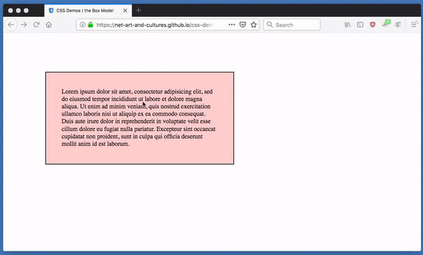

# css-demos

the following is by no means an exhaustive list of CSS properties (u can check those out [here](https://developer.mozilla.org/en-US/docs/Web/CSS/Reference) or [here](https://css-tricks.com/almanac/)), nor is it a general guide to all CSS features (for that checkout Jon Duckett's book [HTML & CSS](http://www.htmlandcssbook.com/) or the Mozilla Developers Network's [CSS tutorials](https://developer.mozilla.org/en-US/docs/Web/Guide/CSS/Getting_started)). the following are some examples/demos highlighting specific CSS properties or issues/questions i often get asked about in class (i can add more to this page if there's something we end up covering in class that isn't on here, just send me an email about what u'd like to see explained)

for a general introduction to what CSS is, how u include it in an HTML page && what the basic structure && syntax of the code is (blocks, selectors, properties, values, etc) refer to the class notes on [CSS](https://github.com/net-art-and-cultures/syllabus-and-notes/tree/master/notes/css). while CSS is typically used for page layout && styling (fonts, colors, etc) there is an active && creative community producing all sorts of experiments that push CSS to it's limits && use it in unconventional ways, for some examples of this "CSS Art" check out this curatedl ist of "[codepens](https://codepen.io/)" (a code sharing + social media site popular among the CSS community) in the class notes under [CSS Art Gallery](https://github.com/net-art-and-cultures/syllabus-and-notes/tree/master/notes/css-gallery)

# how to make use of this repo

u can follow the examples below in order (it more or less goes from basic to less-basic) or u can jump around to specific topics u want to learn more about. clicking the links will take u to another markdown page (a `.md` file) w/documentation on that particular subject (these are also found in the "notes" directory of this repo) && those pages will link to different HTML pages w/the CSS examples in them (these are also found in the "demos" directory of this repo).

in addition to reading the notes associated with each example, i highly recommend that u also right-mouse click (or CTRL+click or two-finger click w/ur track-pad) on the different elements on the example pages to inspect them w/the Web Inspector i showed u in class. this way u can experiment w/them by changing their CSS values or adding some properties of ur own. playing w/these examples in the Web Inspector is a great way to better understand this stuff. (*FYI, u can switch ur web developer tools from light theme to dark theme in the settings, which u can get to by clicking the gear icon, sometimes hidden behind the 3 dots icon, on the top-left corner of the dev tools*)

u can look through these notes && examples, inspect them && copy+paste any bits of code that u want to reuse/remix, but u could also "clone" this repo so that u can have a local copy on ur computer && experiment w/these examples that way. keep in mind i own this repo (not u) so if u make any changes && try to "push" those back up to this repo, u won't be able to b/c u're not authorized. that said, u can "fork" this repo to make ur own copy on ur GitHub account. if u clone ur forked version of the repo u will be able to push any changes u make back up to ur forked copy. then if u create any new examples u want to share back u can submit a "pull request" so that ur changes can be included in this original repo :)

## the basics

[the "Cascade" in Cascading Style Sheets](notes/the-cascade.md)

[different units of measurement.](notes/css-units.md)

[there are lots of ways to specify colors.](notes/css-colors.md)

[HTML elements are all boxes.](notes/the-box-model.md)

[there's a bunch of ways to center things.](notes/centering-things.md)

[how to change CSS when u hover && CSS Transitions.](notes/hover-transitions.md)

[Typography + Custom Fonts](notes/typography.md)

## layout

[the position property.](notes/position.md)

[the transform property.](notes/transform.md)

[old-school approaches to grid layout](notes/layout-old.md) (for context).

[modern approaches to grid layout: Flexbox && CSS Grids](notes/layout-modern.md)

## Responsive Web Design...

[...also known as "mobile first"](notes/media-queries.md)

## CSS animations...

[...in a bit more depth than we covered in class](notes/css-animations.md)

## epilogue

[vendor (browser) prefixes && future CSS](notes/vendor-prefixes.md)
