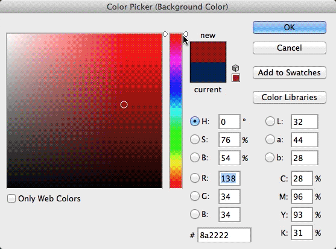

# CSS Colors

there are a few CSS properties that take a color as a value: `background-color`, `color` (which changes the font color), `border-color` && others (do a search for "color" on [this page](https://developer.mozilla.org/en-US/docs/Web/CSS/Reference) to see 'em all). there are a number of different ways to describe colors in computers && CSS accepts most of them.

## types of values

**color names**: there are [147 color names](http://www.w3schools.com/cssref/css_colornames.asp) like "green", "tomato", && "whitesmoke" which can be used as values. using color names isn't very common, u're more likely to see somone use `color:#ffffff` rather than `color:white`, or `color:#000` rather than `color:black`

**hex codes**: likely the most common method, these can be either 3 or 6 characters long preceded by a `#` symbol. when using three characters they represent represent red, green && blue values (in hex, ie. between 0 - F). using six characters gives u more options (00 - FF), ex: `#FF0000` is red, `#00FF00` is green && `#0000FF` is blue.

**rgb values**: similar to hex in that it describes a color based on how much red, green && blue there is, except that it takes values from 0 - 255 for each && is written like this: `color: rgb(255,0,0);` is red, `color: rgb(0,255,0);` is green && `color: rgb(0,0,255);` is blue.

**hsl values**: hsl stands for hue (degrees from 0 - 360 specifying a spot on the [color wheel](https://en.wikipedia.org/wiki/Color_wheel), 0 being red, the top of the wheel), saturation (the amount of gray in a color, from 0 -100%) && lightness (the amount of white or black, 0 - 100%, 50% being normal), `color: hsl(0,100%,50%);` is red, `color: hsl(120,100%,50%);` is green && `color: hsl(240,100%,50%);` is blue.

#### opacity / alpha

CSS3 introduced opacity (transparency) which is described via a float value between 0.0 - 1.0, there's a few ways to specify it: either w/the `opacity: 0.5;` property or by adding an 'a' (alpha) to either rgb or hsl like this: `color: rgba( 255, 0, 0, 0.5 );` or color: `hsla( 0, 100%, 50%, 0.5 );`
