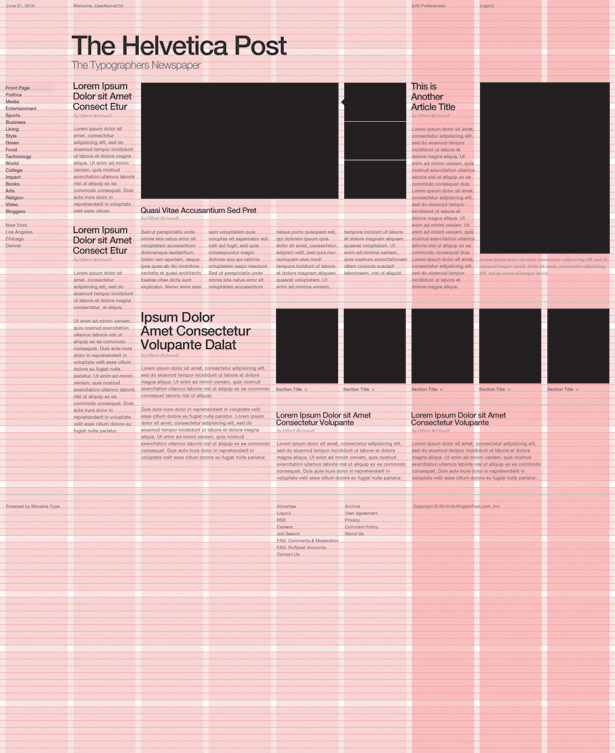

# old school grid layouts

**IMPORTANT NOTE: i generally do not recommend using any of these methods in ur own layout. they are here for context/perspective. now that we have [flexbox && CSS Grid](layout-modern.md) i usually recommend one of those two approaches. still, understanding how developers used to do it can be illuminating (if u can understand custom CSS grids approach below u'll have a better understanding of how CSS's box model works in general). also, not everyone out there is up to date on the latest CSS, so if u copy+paste code u find on the Internet u might come across older techniques, so reviewing these notes will make it more likely that u will recognize it in the wild.**

## things change...

in the beginning there was HTML 1.0 ( [c1991-2](http://www.w3.org/History/19921103-hypertext/hypertext/WWW/MarkUp/MarkUp.html#4) ). HTML was designed for creating hypertext “documents”, headers, paragraphs && data displayed in a single scrollable column. w/ HTML 2.0 came ’s ( [c1995](https://tools.ietf.org/html/rfc1866) ) && w/ HTML 3.0 came <table>’s ( [c1996](https://tools.ietf.org/html/rfc1942) ). though table’s were initially intended to be used to display data, web designers realized they could be used along w/ images ( including small transparent [shim.gif](https://www.google.com/search?site=imghp&tbm=isch&q=shim.gif)) to hack together different kinds of layouts, && thus the first layout conventions were born. w/ CSS 1 && 2 ( c1996-8 ) came positioning properties which changed the layout norms a bit. in 1996 Macromedia purchased FutureSplash Animator from FutureWave && renamed it Flash 1. Flash changed the layout game yet again. by the late 2000’s desktops weren’t the only devices accessing websites && most mobile devices didn’t support Flash. it became important to design a site whose layout looked good on any device, it had to be a “flexible”, “liquid”, “fluid” design. In 2012 CSS3 Media Queries ( [@media](https://en.wikipedia.org/wiki/Media_queries) ) became key to creating “mobile first” and “responsive web designs”, creating a whole new set of layout best-practices which dominate today. but what about tomorrow?2

the point of this *brief history of wwweb layout “best-practices”* is to highlight two things: first, best-practices are always changing && second, there’s always another way to do the same thing; while it’s helpful to know what the best-practices are, it’s more important to realize that they’re always changing... best to be comfortable w/that fact.

## HTML `<table>`

as mentioned above, custom layouts where born in the mid 90's thnx to the addition of the `` element && the `<table>` element. table elements let u define rows using the `<tr>` && columns w/the `<td>`, they looked like this:

```html
<table style="width:100%">
 <tr>
   <th>Firstname</th>
   <th>Lastname</th>
   <th>Date of Birth</th>
 </tr>
 <tr>
   <td>Ada</td>
   <td>Lovelace</td>
   <td>10 December 1815</td>
 </tr>
 <tr>
   <td>Charles</td>
   <td>Babbage</td>
   <td>26 December 1791</td>
 </tr>
</table>
```

i haven't created any demos for HTML tables, b/c again i DO NOT recommend using them anymore (this is very old school). these notes are here for context/background.

## CSS grids from scratch



web-designers think layout in terms of grids. as i mentioned before, there was a time when we used `<table>` to create grid-type layouts, this however wasn’t what the table element was designed for && as is often the case w/these sorts of hacks, using tables this way comes w/a few issues. && so eventually developers started creating their own table-like grid using divs && CSS. below is one such approach.


#### step 0: the HTML grid ( rows && columns )

```html
<div class="container">
  <div class="row">
    <div class="column"> 1st row, 1st column </div>
    <div class="column"> 1st row, 2nd column </div>
  </div>

  <div class="row">
    <div class="column"> 2nd row, 1st column </div>
    <div class="column"> 2nd row, 2nd column </div>
    <div class="column"> 2nd row, 3rd column </div>
  </div>

  <div class="row">
    <div class="column"> 3rd row, 1st column </div>
  </div>
</div>
```

#### step 1: create a container class

```CSS
.container{
  width:90%;
  margin: 0 auto;
  max-width: 960px;
}
```

create a class for the parent container which will wrap ur grid. by default block elements have a width of 100%, lets give it a little breathing room on either side by making the width only 90% ( give or take ). next we’ll center it using the `margin: 0 auto;` trick. lastly, we’ll give it a max-width of 960px ( or so ), the reason for this is to prevent our grid from becoming absurdly wide on large screens, it will always be 90% of the page, until 90% = 960px at which point it caps at that.

#### step 2: border-box

```css
*, *:before, *:after {
  box-sizing: border-box;
}
```
if u decide to give ur container some padding or borders, the max-width property won’t take those into consideration ( so for example if u’ve got padding of 20px on either side the max-width will actually be 960 + 40 = 1000px ), u can get around this by setting the `box-sizing: border-box;`, which will take the padding && border into account when applying max-width. let’s apply this to everything or * ( it'll come in handy for some of our other classes too )


### step 3: create a column class

```css

.column {
  float: left;
}

.column.full { width: 100%; }
.column.two-thirds { width: 66.7%; }
.column.half { width: 50%; }
.column.third { width: 33.3%; }
.column.fourth { width: 25%; }
```

next we’ll create a column class that `float: left;` as well as additional classes for distinguishing between column sizes ( full width, half width, quarter width, etc. ). update ur html accordingly, so that the columns inside rows where there’s two columns have the additional class of “half” && where the columns are inside rows w/three columns they each have an additional class of “third” etc.


#### step 4: clear fix

```css
/* ----- Clearfix by Nicolas Gallagher ----- */
.clearfix:before,
.clearfix:after { content: " "; display: table;}
.clearfix:after { clear: both; }
.clearfix { *zoom: 1; }
```

if ur container has some kind of border or background-color u might notice that it’s not wrapping around ur grid of rows/columns, this is because of a CSS quirk which happens when u’ve got all the elements floating, they won’t expand the height of their parent container as they normally would if they had been in the normal flow ( ie. not floating ). one way to get around this is to use the [clearfix](http://nicolasgallagher.com/micro-clearfix-hack/) by Nicolas Gallagher. add the clearfix class to all of ur rows.
