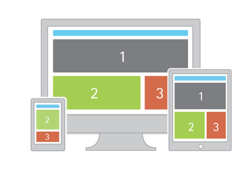

# Responsive Web Design



grids look great on desktops, but not so much on smaller devices ( like phones ). these days there’s no telling what device someone might use to visit ur page, so it’s recommended to design ur site in such a way that it is adapts or “responds” differently to different screen sizes, this is generally referred to as “responsive web design” ( RWD ). below we’ll continue where we left off adapting our grid to be a bit more “responsive”

one key to achieving this is using CSS3 media queries, which are like conditional statements for CSS. u may notice that in the image above the gray “1” box disappears when it’s displayed on a phone. the way u do this is to create a media query which says “if the width is smaller than a certain size do the following” or “if the page’s width isn’t the specified max-width, do the following”. the code below would achieve this.

```CSS
.gray {
  background-color: #7C7D81;
  color: #fff;
  font-family: sans-serif;
}

@media (max-width: 640px) {
  .gray { display:none; }
}
```

the gray box will only be `display: none;` (ie. disappear) if the window size is less than 640px, but it will reappear if it grows larger than that. u can setup multiple media queries for various screen sizes.

the two layout examples from the notes on flexbox && CSS grid layouts look great until the width of the window gets below 600px or so. check out these media query demos for how we might change our [flexbox](../demos/layout-rwd-ex1.html) && [CSS grid](../demos/layout-rwd-ex2.html) so that it looks better on "mobile" && smaller screens. as usually, use ur web inspector to experiment w/these.


## the Viewport meta tag

at this point things should be responding as expected on ur desktop, but the moment u upload ur project to the web && actually visit it on ur phone u might be surprised to see it NOT responding as expected. by default most phones will just “zoom out” so that the page renders the same way on the phone as it does on desktop ( && u’ll be left w/a tiny looking version of ur website ) to get around this we need to use the viewport meta tag, which will force the mobile browser to behave as we’d expect.

```html
<meta name="viewport" content="width=device-width, initial-scale=1">
```
