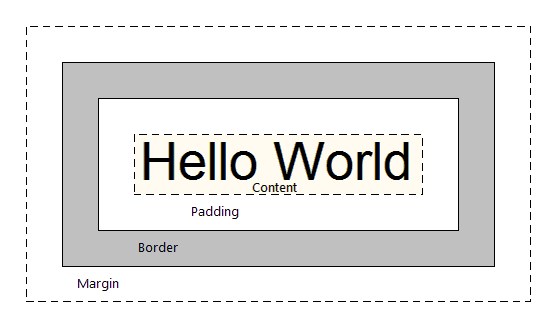

# the Box Model

every element in an HTML page is a box, there’s essentially two kinds of boxes depending on whether the element is an inline element or a block element. every element is one of those by default: ` <a> ` are all inline elements `
 <h1> 
` are all block elements. but these defaults (like all defaults) can be overridden via CSS, in this case w/the `display` property, for ex: `img { display: block }`. the basic difference between the two is that block elements have default widths of 100% (so they stretch from the far left to the far right of their parent element) whereas inline elements are only ever as wide as their content. additionally, block elements always force a line-break (so they appear one on top of the other like a column), whereas inline elements line up next to each other (like a row).

### [ex 1: block vs inline](https://net-art-and-cultures.github.io/css-demos/demos/the-box-model-ex1.html)

in this first example i've got 3 divs && 3 spans with only a little CSS to change their background color (so that we can see the actual boxes). the divs are "block" elements by default so those will be stacked vertically as well as expand the full width of their parent element (in this case the `<body>` element). the spans are "inline" elements by default so those will be lined up horizontally && only be as wide as the content inside of them.

use ur browser's "Inspector" tool (like we did in class) to edit the CSS of these elements. see what happens when u change a div from block to inline by adding `display: inline` to its CSS, or vice-versa: change a span from inline to block by adding `display: block` to its CSS. u could also make the element disappear by changing it to `display: none`.

### [ex 2: the box model properties](https://net-art-and-cultures.github.io/css-demos/demos/the-box-model-ex2.html)

there are a set of properties often associated w/the box model which are: `margin`, the space around the box. `padding` the space inside the box, between the edges of the box && it's content. `border` the outline around the box between the margin && padding. in this second example i've placed a single `
` element inside the body && applied margin, border && padding to it (p elements are block elements by default, so i've also given the element a specific width value so it doesn't stretch to the full width of the page as well as a background-color so we can see the actual box). use ur browser inspector tool to edit the values in the example.

in this example the margin && padding both have a single value like: `margin: 100px;` which means all 4 sides of the box will have the same amount of margin && padding. but there are other ways to write this for example when u pass two values to margin (or padding) like this: `margin: 100px 50px`, the first value gets applied to the top && bottom of the box, && the second value gets applied to the left && right side. u could also do this `margin: 10px 20px 40px 20px;` where u pass four values (one for each side), starting from the top, then going clockwise (second value is for the right side, third value for the bottom && fourth value for the left side). u could also specify specificly which side u want to apply margin to like this `margin-top: 10px;` &&/or `margin-bottom: 10px` &&/or `margin-left: 10px;` &&/or `margin-right: 10px;` (the same is true for padding && border).

**NOTE**: u might have noticed that even when the margin is set to 0 there is still a little bit of space between the div && the top left hand corner of the browser, this is b/c the `
` is inside the `<body>` element && the body element has a bit of margin set on it by default. but u can remove this by adding `body { margin: 0; }` to ur stylesheet. (try using the inspector to select the body element && remove it's margin to see the difference).

### [ex 3: box-sizing](https://net-art-and-cultures.github.io/css-demos/demos/the-box-model-ex3.html)

in this last example we have two divs with an image i made (a ruler measuring in pixels) between them. both divs have the same width value applied `width: 200px`, but if u look at the ruler u'll notice the first div extends out to 250px while the second div is 200px. this is b/c in addition to the width value, the divs also have a border of 5px && a padding of 20px. the default box-sizing of a div is `box-sizing: content-box;` which means the full width of the visible div (which means not including margin which is invisible) will be the width value (200px) + the border (5px on the left && another 5px on the right) + the padding (20px on the left && 20px on the right) for a total of 250px. sometimes this might be what u want, but other times (especially when working on responsive web design) u want the width of the visible element to be exactly what u specified in the width value. in order to get this behavior u need to change the default box-sizing to `box-sizing: border-box`. this is what's applied to the second div (via the 'b-box' class) which is why it only extends out to 200px. to learn more about box-sizing checkout this post on [css-tricks](https://css-tricks.com/box-sizing/).
